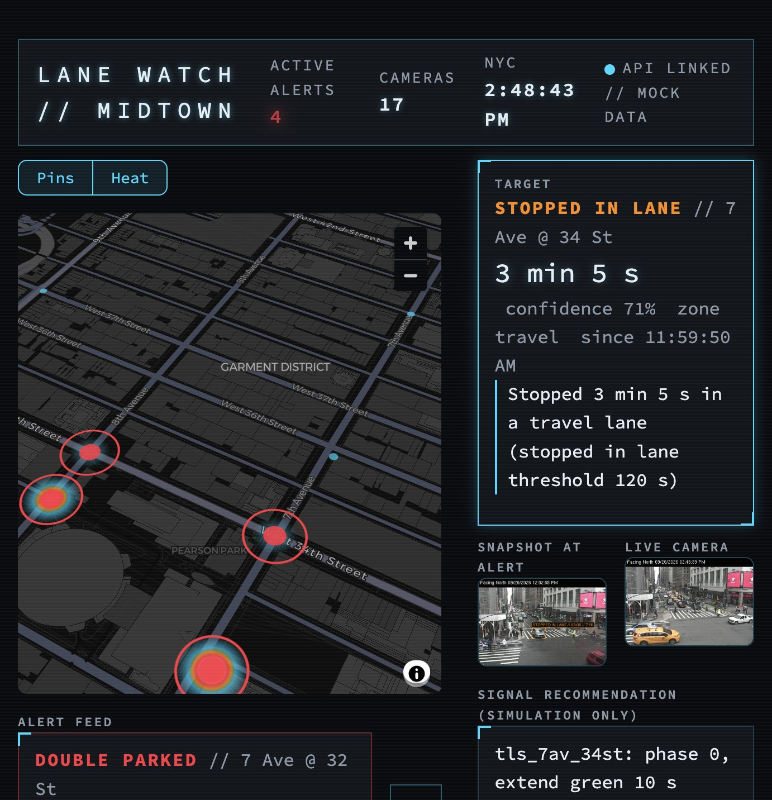

# Lane Watch dashboard: functional spec and design brief

The dashboard is the operator-facing part of Lane Watch and the screen the demo runs on. Everything
else (cameras, detection, event rules, retiming, SUMO) is machinery behind the API; this is where
its output becomes a decision a human makes. This doc lists what the screen must do, the data it
gets, and the constraints a design has to respect. Issue #7 builds the first version; later issues
add to it (see [Later additions](#later-additions)).

First version (issue #7) on mock data, in a narrow window where the two columns stack:



## Who uses it and what for

**Primary user:** a NYC DOT Traffic Management Center (TMC) operator watching many cameras at once.
**Demo audience:** hackathon judges watching a projector for 3 minutes.

The operator's questions, in order. Every element on the screen answers one of them:

| # | Question | Answered by |
|---|---|---|
| 1 | Is anything wrong right now, and where? | Header counts, map pins, heatmap |
| 2 | What exactly is happening? | Alert feed, alert detail, snapshot with target box |
| 3 | Should I believe it? | Reason line, confidence, live camera frame next to the snapshot |
| 4 | What should I do about it? | Signal recommendation card with simulated effect |
| 5 | Decide | Accept / reject / false positive (issue #18) |

## Screen layout

One screen, no navigation. Designed for 1440x900 (laptop and projector); must stay usable down to
about 1024 wide, where the two columns may stack.

```
+----------------------------------------------------------------------------------+
| HEADER: product name | active alerts | cameras | NYC clock | API status + data mode |
+------------------------------------------------+---------------------------------+
| LAYER TOGGLE [Pins] [Heat]                     | ALERT DETAIL (selected alert)   |
| MAP                                            |  type, camera, duration, conf,  |
|  camera pins, alert rings, stopped-car heat    |  zone, start time, reason line  |
|                                                +----------------+----------------+
|                                                | SNAPSHOT       | LIVE CAMERA    |
|                                                | (at alert,     | (now, refresh  |
|                                                |  target box)   |  every 5 s)    |
+------------------------------------------------+----------------+----------------+
| ALERT FEED (list, active first, newest first)  | SIGNAL RECOMMENDATION           |
|  [type // camera | 04:15 | conf | since] [View]|  changes + delay/queue A vs B   |
+------------------------------------------------+---------------------------------+
```

## Functional requirements

### F7.1 Header bar
- Product name: `LANE WATCH // MIDTOWN`.
- Active alert count (red, pulsing when above 0).
- Camera count.
- Current New York time, updating with each refresh.
- API status: linked / offline, plus `MOCK DATA` when the API is in mock mode.

### F7.2 Map
- Dark basemap centered on the chosen cameras (Penn Station / Herald Sq, about 8 by 10 blocks).
  Slight 3D tilt is fine; north need not be up.
- **Camera pins:** every camera from the API (17 today). Idle cameras are small cyan dots; cameras
  with an active alert are larger, red, with a red ring. Offline cameras are grey.
- **Stopped-car heatmap:** heat at each active alert's camera, weighted by
  `min(duration / rule threshold, 5) x confidence`. So a van 4 minutes past a 60 s threshold glows
  much hotter than a box blocked for 25 s. Frozen-feed events add no heat.
  Heat is per camera location (events carry a camera, not a street position), so it appears as
  blobs at camera spots, not along streets.
- **Layer toggle:** Pins, Heat, or both (default both).
- Hover a pin: camera name and number of active alerts.

### F7.3 Alert feed
- One row per event: type (colored by type), camera name, duration as a `MM:SS` counter,
  confidence, start time in New York time, and `ENDED` for inactive events.
- Order: active first, then newest first.
- Selecting a row (the View button) shows that alert in the detail panel. The selection must
  survive the 2 s refresh.
- Active alert rows have a red border; the selected row has a cyan glow.
- Empty state: "No alerts."

### F7.4 Alert detail
- Type, camera name, duration (e.g. "4 min 15 s"), confidence, lane zone, start time.
- **Reason line** (rule-based, always present), e.g.
  "Stopped 4 min 15 s in the travel lane next to the curb (double parked threshold 60 s)".
  Thresholds come from `events/rules.yaml`, so tuning the rules updates the text.
- **Snapshot at alert:** the event frame with corner-bracket targeting around the vehicle and a tag
  such as `DOUBLE PARKED // 04:15 // 84%`. Only the vehicle is marked, never people or plates.
  Empty state: "No snapshot."
- **Live camera:** the camera's current frame, refreshed every 5 s, so the operator can check the
  vehicle is still there. Empty state: "Camera not in the list."

### F7.5 Signal recommendation card
- Label: "Signal recommendation (simulation only)". Nothing on this screen changes real signals.
- One line per signal change, e.g. `tls_8av_32st: phase 0, cut green 6 s`. IDs are placeholders
  until issue #13 maps cameras to real SUMO traffic lights.
- Simulated effect, default plan vs recommended: average delay per vehicle (s) and max queue on
  the blocked approach (vehicles). Default in red, recommended in cyan.
- States: no recommendation yet (API 404) / simulation running (`sim` is null) / done.

### F7.6 Refresh and failure behavior
- Data refreshes every 2 s without reloading the page or losing the selection or map toggles.
- A new event POSTed to the API appears within 5 s.
- An event whose duration grows (same id POSTed again) updates its counter in place.
- API unreachable: header shows `API OFFLINE`, a warning explains it, and the page keeps retrying.
  It must never show a crash.

### Active alert (definition)
An event is active if it was last seen within 5 minutes: `start_ts + duration_s >= now - 300 s`.
In mock mode every event is active (the mock events are from earlier today).

## Data the screen gets

All from the Lane Watch API (`LW_API_URL`, default `http://localhost:8000`); shapes are defined in
`common/schemas.py`.

| Endpoint | Returns |
|---|---|
| `GET /health` | `{"status": "ok", "mock_mode": true}` |
| `GET /cameras` | `[{id, name, lat, lon, area, image_url, is_online}]` |
| `GET /events?limit=100` | newest first: `[{id, camera_id, type, start_ts, duration_s, bbox, lane_zone, confidence, snapshot_path}]` |
| `GET /events/{id}/snapshot` | the event's raw JPEG (352x240); the dashboard draws the box |
| `GET /recommendations/{event_id}` | `{event_id, intersections: [{id, phase, change_s}], sim: {delay_default, delay_new, queue_default, queue_new} or null}`, or 404 |
| camera `image_url` (NYCTMC) | live JPEG, loaded directly by the browser |

Value sets:
- `type`: `double_parked`, `stopped_in_lane`, `blocked_box`, `frozen_feed`
- `lane_zone`: `curb`, `curb_adjacent`, `travel`, `box`, `bus_stop`, `ignore`, `none`
- times are UTC ISO-8601; show them in New York time

Example event (from `data/mock/events.json`):

```json
{
  "id": "evt_mock_001",
  "camera_id": "6a85384f-d82e-4bff-b5f1-15c22cca70e6",
  "type": "double_parked",
  "start_ts": "2026-09-26T15:58:40Z",
  "duration_s": 255,
  "bbox": [104, 92, 134, 126],
  "lane_zone": "curb_adjacent",
  "confidence": 0.84,
  "snapshot_path": "data/mock/snapshots/double_parked.jpg"
}
```

Mock data today: 3 events (double parked on 8th Ave @ 33rd St, stopped in lane on 7 Ave @ 34 St,
blocked box on 8 Ave @ 34 St) and 3 recommendations, one with the simulation still running.

## Visual language: ctOS style

Inspired by the ctOS interface in Watch Dogs 1. Original design only: no game logos, fonts,
icons or other assets. It must stay high-contrast and readable on a projector.

| Token | Value | Use |
|---|---|---|
| Background | `#0a0c0f` | page |
| Panel | `#12161b` | cards, header |
| Text | `#e6edf3` | body text |
| Muted | `#8b98a5` | labels, secondary text, offline |
| Cyan | `#00d8ff` | primary accent, borders, idle pins, "recommended" numbers |
| Orange | `#ff8a00` | stopped in lane, warnings |
| Red | `#ff3344` | double parked, active alerts, "default" numbers |
| Yellow | `#ffd400` | blocked box |

- Monospace type; uppercase, letter-spaced labels and headers.
- Thin cyan panel borders with corner brackets; a faint scanline overlay on the page.
- Glow on key numbers; a slow red pulse on the active-alert count; a brief glitch on the title on
  hover only (nothing flashing continuously).
- Heatmap ramp: transparent, cyan, orange, red.
- Event type colors are the same everywhere: feed, detail, snapshot target, map.

## Constraints a design must respect

- **Privacy:** no plates, no faces. Snapshots mark vehicles only.
- **Simulation only:** never imply real signals change; say "simulation" on the recommendation
  and later on "applied (sim)".
- **Low-res frames:** camera images are 352x240. The dashboard shows them at 2x; don't design
  for larger detail than that.
- **Built in Streamlit**, so a design must be implementable with:
  - HTML/CSS injected into the page (panels, header, typography, color, simple CSS animation)
  - a pydeck (deck.gl) map: scatter, ring and heatmap layers, Carto dark basemap, tooltips
  - Streamlit widgets for interaction (buttons, toggles); no custom JavaScript
  - clicking a map pin to select an alert is not reliable; selection happens in the feed
- **Honesty:** mock and replay data must be labeled as such on screen.

## Later additions (leave room in the layout)

| Issue | Adds |
|---|---|
| #17 | "Delay saved" on the recommendation card; default vs recommended side-by-side (SUMO screenshots or queue-over-time charts) |
| #18 | Accept / reject / false-positive buttons on the alert detail; accepted alerts show "applied (sim)" |
| #19 | One-paragraph LLM incident summary on the alert detail |
| #20 | Live mode: offline and frozen cameras skipped; must survive a wifi drop |
| not yet filed | Full mode indicator (mock / replay / live); camera health on the map; plain-language signal names after #13; congestion heat layer from detector vehicle counts |

## Demo script mapping

| Demo step | What the screen must show |
|---|---|
| 2. Live system (40 s) | Map with live cameras; switch to replay; the alert's counter climbs and it fires at the threshold |
| 3. The decision (40 s) | Alert detail: snapshot, type, confidence, reason (and LLM summary, #19); recommendation for the upstream signal; operator clicks accept (#18) |
| 4. The payoff (40 s) | Default vs recommended side-by-side with delay saved (#17) |
